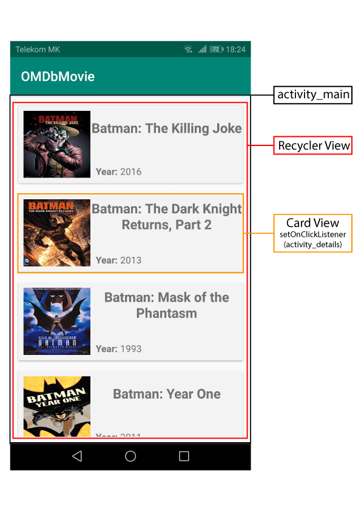
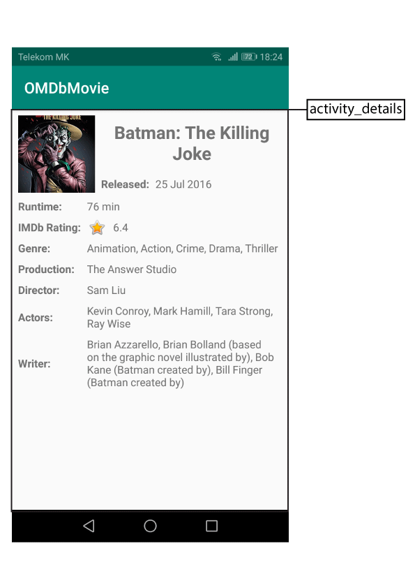

# Android_OMDb_Movie-List
OMDb Movie-List  JSON-API

## Description

  ### 1. Usaged:
   - Card View
   - Recycler View
   - url_API ( http://www.omdbapi.com/ )
   - Volley Library
   - Glide Library
   

  ### 2. Add dependency 
   build.gradle.(Module: app)
    
    dependencies {
        
      // Card View
      implementation 'com.android.support:cardview-v7:28.0.0'

      // Recycler View
      implementation 'com.android.support:recyclerview-v7:28.0.0'

      // Volley library
      implementation 'com.android.volley:volley:1.1.0'

      // Glide library
      implementation 'com.github.bumptech.glide:glide:4.9.0'
    }
  
  ### 3. Add AndroidManifest

	<!-- Internet Permission -->
 	<uses-permission android:name="android.permission.INTERNET" />

 	<application

      <!-- Intent Details Activity -->
      <activity android:name=".activity.DetailsActivity"></activity>
		
	</application>
      
  ### 4. Create:                          

   **Package / Class:**
   - **activity (Package)**
      - DetailsActivity.class
   - **adapter (Package)**
      - MovieAdapter.class
   - **model (Package)**
      - MovieModel.class
      - DetailsModel.class
      
   - MainActivity.class   
   
  **layout:**
   - activity_main.xml
   - activity_details.xml
   - item_movi.xml
 
  ### 5.Concept:
       

### 6.Demo:

## Author: Nikola Petkovik
  ### contact:
   - Gmail: nikolapetkovik86@gmail.com
   
